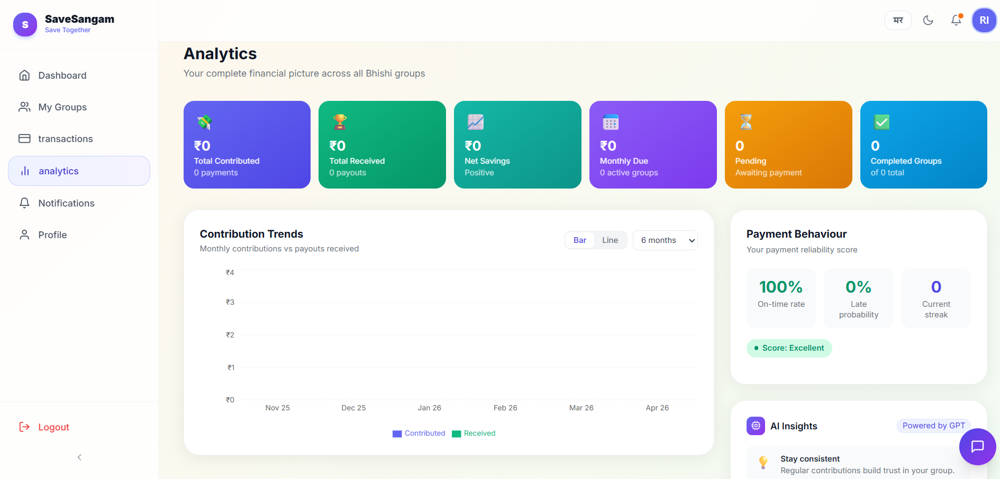
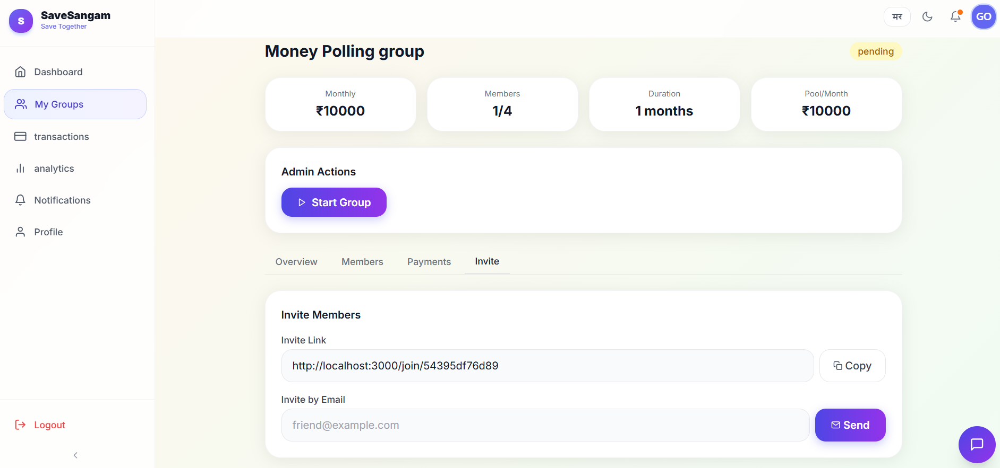
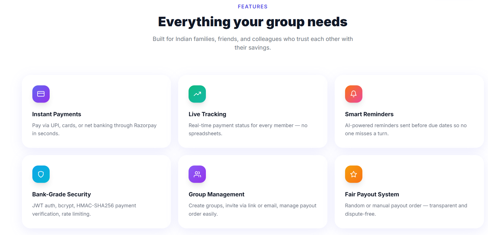
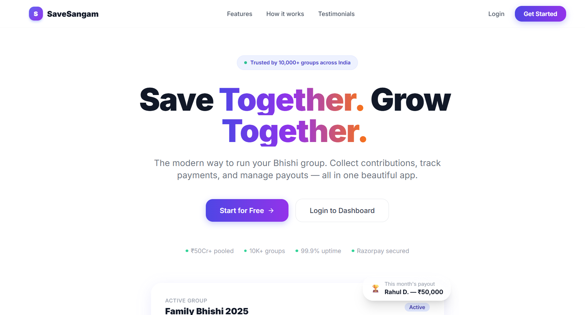

<!-- 🌈 Animated Header -->

<p align="center">
  
</p>

<h3 align="center">💰 Smart Bhishi (ROSCA) Platform</h3>

<p align="center">
  🚀 Real-time FinTech system for group savings, payments & automation
</p>

<p align="center">
  
  
  
</p>

---

 ## 🎥 Live Demo

<p align="center">
  <a href="https://rosca-w768.onrender.com" target="_blank">
    👉 Click here to explore the live application
  </a>
</p>

---

## ✨ Why This Project Stands Out

<p align="center">

🚀 <b>Real-time multi-user fintech system</b>    |   
💳 <b>Secure payment workflow</b>    |   
⚡ <b>Live WebSocket updates</b>    |
📊 <b>Insightful dashboards</b>    |   
🔐 <b>Production-grade security</b>

</p>

---

## 📸 UI Preview

<p align="center">
  
  
</p>

<p align="center">
  
  
</p>

---

## 🧠 System Architecture


---

## 🔥 Core Features

### 🔐 Authentication

* JWT-based login & session management
* bcrypt password hashing (12 rounds)
* Secure password reset via email
* Role-based access control

---

### 👥 Bhishi Group Management

* Create & manage savings groups
* Invite via link or email
* Join / leave groups
* Lifecycle: `Pending → Active → Completed`
* Smart pool calculation

---

### 💳 Payment System

* Razorpay integration (UPI / Cards / Net Banking)
* Secure backend order creation
* HMAC-SHA256 verification
* Prevent duplicate payments

---

### 🏆 Payout Engine

* Random payout assignment
* Monthly payout tracking
* Auto-complete after all payouts

---

### ⚡ Real-Time Features

* Live payment updates (Socket.io)
* Group-based rooms
* Instant UI sync

---

### 🔔 Notifications

* In-app notification center
* Email alerts (payments, invites, payouts)
* Real-time updates

---

## 📊 Dashboard & Analytics

✨ Animated stats cards
📈 Interactive charts (Recharts)
📌 Payment tracking
📉 Group progress visualization

---

## 🎨 UI / UX Highlights

* Modern fintech-inspired UI
* Smooth animations (Framer Motion)
* Dark mode support
* Mobile-first responsive design
* English + Marathi support

---

## 🛠️ Tech Stack

| Frontend      | Backend            | Database   | Integrations |
| ------------- | ------------------ | ---------- | ------------ |
| React.js      | Node.js            | MongoDB    | Razorpay     |
| Tailwind CSS  | Express.js         | PostgreSQL | Socket.io    |
| Framer Motion | FastAPI (optional) |            | Nodemailer   |

---

## ⚙️ Getting Started

```bash
# Clone the repository
git clone https://github.com/riyaa2210/ROSCA

# Install dependencies
cd backend && npm install
cd ../frontend && npm install

# Run project
npm run dev
```

---

## 📂 Project Structure

```
/frontend
/backend
/screenshots
```

---

## 🚀 Future Enhancements

* 📱 Mobile app version
* 🤖 AI-based savings recommendations
* 📊 Advanced analytics dashboard

---

## 📬 Connect With Me

<p align="center">
  <a href="https://github.com/riyaa2210">GitHub</a> •
  <a href="https://www.linkedin.com/in/riya-ransing-86607a318">LinkedIn</a> •
  <a href="mailto:ransingriya@gmail.com">Email</a>
</p>

---

<!-- 🌊 Footer -->

<p align="center">
  
</p>

⭐ If you like this project, consider giving it a star!
