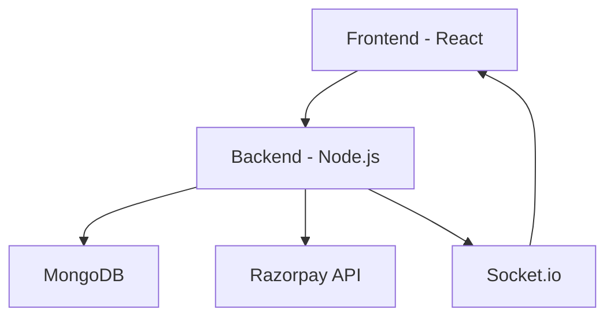

<!-- 🌈 Animated Header -->

<p align="center">
  
</p>

<p align="center">
  💰 Smart Bhishi (ROSCA) Platform — Built for Real-World FinTech
</p>

<p align="center">
  
  
  
</p>

---

<!-- 🎥 Demo Preview GIF -->

## 🎥 Live Demo

<p align="center">
  <a href="https://your-demo-link.com">
    
  </a>
</p>

👉 **Click above to experience the live app**

---
## ✨ Why This Project Stands Out

- 🚀 Real-time multi-user fintech system  
- 💳 Secure payment workflow with verification  
- ⚡ Live updates using WebSockets  
- 📊 Insightful dashboards with analytics  
- 🔐 Production-grade authentication & security  
---

## 📸 UI Preview (Interactive Feel)

<p align="center">
  
  
</p>

<p align="center">
  
  
</p>

---

## 🧠 System Architecture



---

## 🔥 Core Features

### 🔐 Authentication

* JWT-based login system
* Secure password hashing (bcrypt)
* Password reset via email
* Role-based access control

---

### 👥 Bhishi Group Engine

* Create & manage savings groups
* Invite via link/email
* Lifecycle: `Pending → Active → Completed`
* Smart pool calculation

---

### 💳 Payments

* Razorpay integration
* Secure order creation
* Signature verification
* Duplicate payment prevention

---

### 🏆 Payout System

* Random payout assignment
* Monthly payout tracking
* Auto-completion logic

---

### ⚡ Real-Time Sync

* Instant payment updates
* Socket.io rooms per group
* Live UI refresh without reload

---

## 📊 Dashboard Experience

✨ Animated stats
📈 Interactive charts
📌 Real-time updates
📉 Payment tracking

---

## 🎨 UI Highlights

* Glassmorphism + gradient design
* Smooth animations (Framer Motion)
* Dark mode support
* Mobile-first responsive
* English + Marathi support

---

## 🛠️ Tech Stack

| Frontend      | Backend            | Database   | Integrations |
| ------------- | ------------------ | ---------- | ------------ |
| React         | Node.js            | MongoDB    | Razorpay     |
| Tailwind      | Express            | PostgreSQL | Socket.io    |
| Framer Motion | FastAPI (optional) |            | Nodemailer   |

---

## ⚙️ Setup

```bash
git clone https://github.com/riyaa2210/ROSCA
cd ROSCA

# install
npm install

# run
npm run dev
```

---

## 🚀 Future Enhancements

* 📱 Mobile app version
* 🤖 AI-based savings recommendations
* 📊 Advanced analytics dashboard

---

## 📬 Connect With Me

<p align="center">
  <a href="https://github.com/riyaa2210">GitHub</a> •
  <a href="https://www.linkedin.com/in/riya-ransing-86607a318">LinkedIn</a> •
  <a href="mailto:ransingriya@gmail.com">Email</a>
</p>

---

<!-- 🔥 Footer -->

<p align="center">
  
</p>

⭐ *If you found this project interesting, consider giving it a star!*
